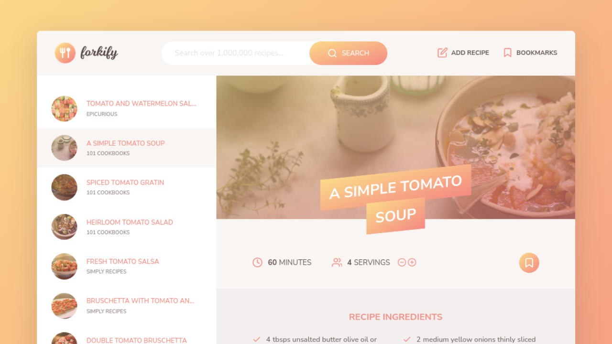

# Forkify Prject

## check out the <a href="https://forkify-nouregy.netlify.app/" target="_blank">live project here</a>

Forkify project Recipe application with custom recipe uploads, built with HTML5, CSS3, JavaScript And API,

<h2>Main Futures</h2>
<ul>
  <li>Creative Layout</li>
  <li>Retina Ready</li>
  <li>search for recipes</li>
  <li>Show recipe details</li>
  <li>Add recipe</li>
  <li>bookmark recipe</li>
  <li>pages in paganation in search</li>
</ul>

<h2>Built with</h2>
<ul>
  <li>HTML, CSS, SASS, JAVASCRIPT</li>
  <li>Forkify-API</li>
  <li>OOP &  Modules & Parcel.js</li>
</ul>

<h2>My Social Media</h2>
<ul>
    <li>Twitter : <a href="https://twitter.com/iNourEgy" target="_blank">@iNourEgy</a></li>
    <li>LinkedIn : <a href="https://www.linkedin.com/in/nouregy/" target="_blank">@NourEgy</a></li>
    <li>Themeforest : <a href="https://themeforest.net/user/nouregy" target="_blank">NourEgy</a></li>
    <li>Website : <a href="https://nour-egy.com/" target="_blank">Nou-Egy.com</a></li>
</ul>
